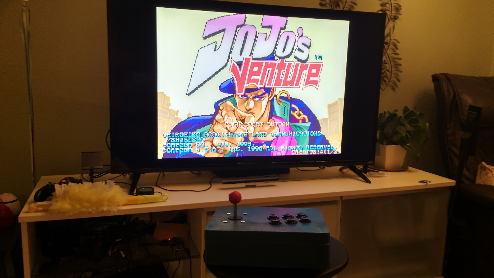

# FightStick

My own arcade fight stick

Firmware credits go to the [UnoJoy](https://code.google.com/archive/p/unojoy/) Team

Because it is hosted on Google Code which has been deprecated, I am hosting their source code in my repo in fear that it will go down. I own none of their software. UnoJoy uses the GNU GPL v3 License.

To get my fight stick to work, I used the BasicFightStick Arduino code I wrote using the UnoJoy library. I then used the suggested method of flashing my Arduino Uno, `sudo dfu-programmer atmega16u2 erase` then `sudo dfu-programmer atmega16u2 flash UnoJoy.hex` to make it into a controller. The Hex file can be found somewhere in the zip file from their source code. I had an Arduino Uno R3. More info can be found [here](https://www.arduino.cc/en/Hacking/DFUProgramming8U2).

I got my [buttons](https://www.amazon.com/gp/product/B00V0Q7YAC/ref=oh_aui_detailpage_o00_s00?ie=UTF8&psc=1) and [joystick](https://www.amazon.com/gp/product/B01N3XBYJK/ref=oh_aui_detailpage_o00_s00?ie=UTF8&psc=1) off of Amazon. Overall the project took roughly a day. It works well with my RetroPie and also works on Windows! Feel free to contact me about my process.

